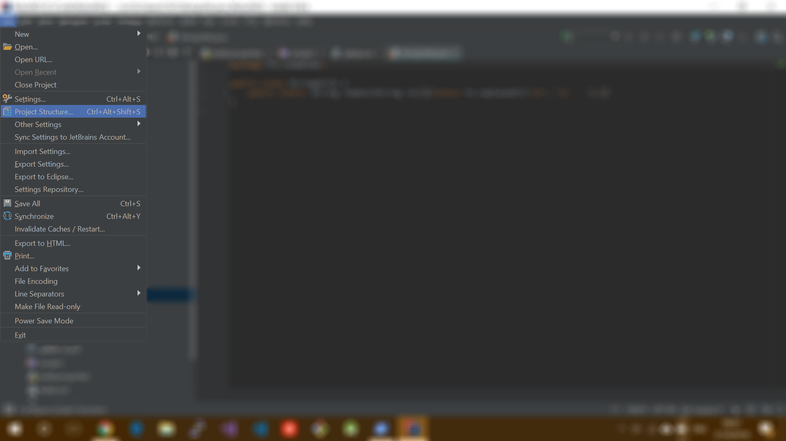
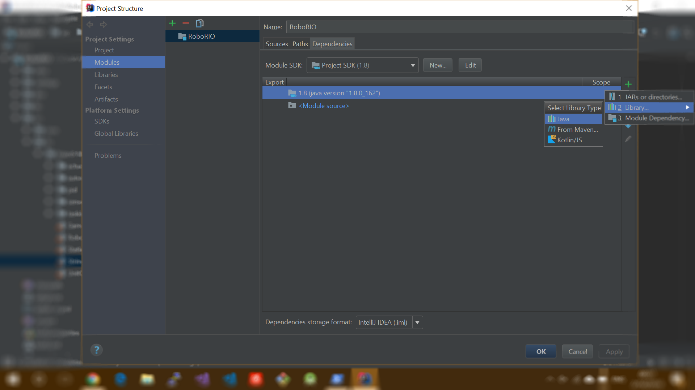
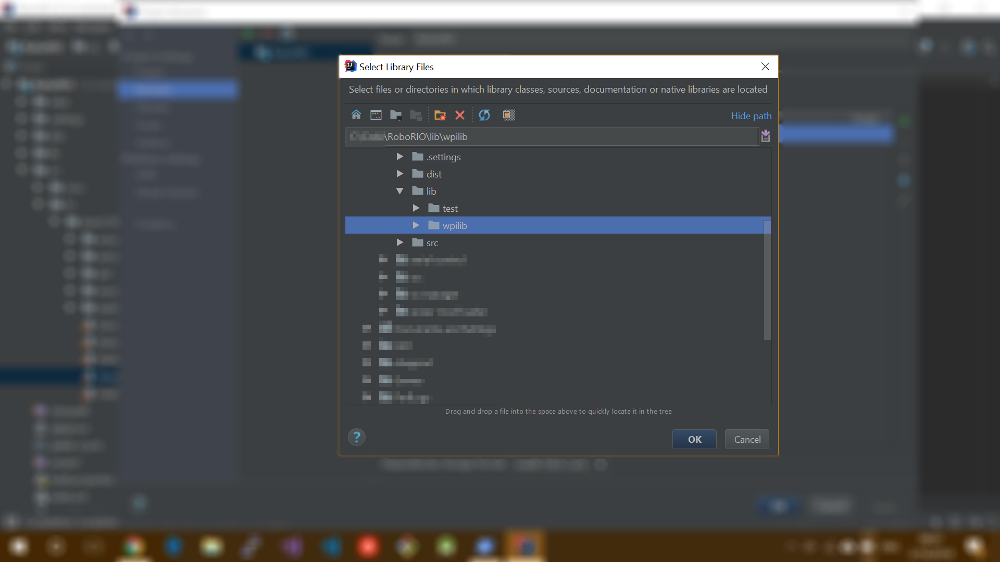
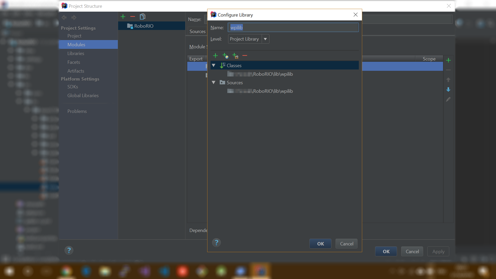

# How to setup your project dependencies

*1\.* After importing this project, find ``Proejct structure`` under the ``File`` submenu in top left corner.

*2\.* In the left column, click ``Modules`` and follow instructions in this picture.

*3\.* Select ``lib\wpilib`` under your root project folder.

*4\.* Then you will have this, click OK. Then in the bigger window, click **Apply**.

*5\.* Now you can restart the build, it should pass the compliation if no bug/syntax error was found. Enjoy.